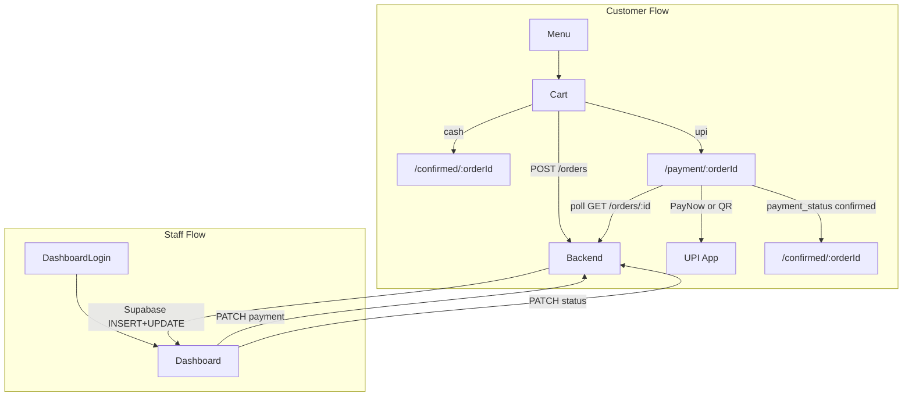
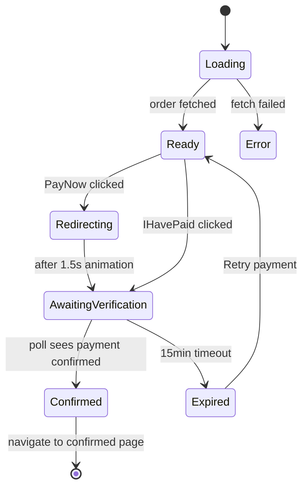
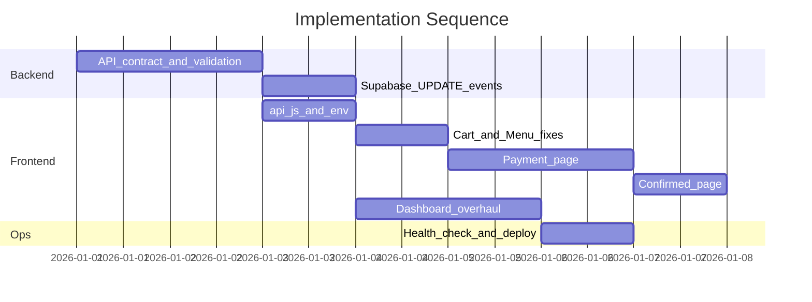

# Chapter 1 — Production-Ready End-to-End Plan

## Current state

Frontend-only repo (`[src/](src/)`) talks to `chapter1-backend-1.onrender.com` and Supabase realtime. Critical gaps today:

- UPI redirects abruptly and falsely claims payment success (`[src/Cart.jsx](src/Cart.jsx)`, `[src/Confirmed.js](src/Confirmed.js)`)
- Cart never clears; no error handling on checkout
- Dashboard hides order items, duplicates orders, uses `key={index}`, bell logic is broken (`[src/Dashboard.jsx](src/Dashboard.jsx)`)
- No env-based config, no loading/error states on menu
- Backend is source of truth only partially (prices calculated on client)

**Payment verification choice (confirmed):** Staff confirms UPI on dashboard. No payment gateway in v1.

---

## Target architecture




---

## Phase 0 — Foundation (backend + shared frontend config)

Do this first; everything else depends on a stable API contract.

### Backend changes


| Endpoint                    | Change                                                                                                                                                                                                                               |
| --------------------------- | ------------------------------------------------------------------------------------------------------------------------------------------------------------------------------------------------------------------------------------ |
| `POST /orders`              | **Server-side price validation**: look up each `item.id` in menu DB, compute `total_amount` in paise, reject unknown/stale items with 400. Return `{ id, total_amount, items, payment_method, payment_status, status, created_at }`. |
| `GET /orders/:id`           | **New** — return single order (for payment + confirmed pages). Include `items` JSON array: `[{ id, name, quantity, price }]`.                                                                                                        |
| `GET /orders`               | Add query params: `?active=true` (status in `received,preparing` OR payment pending) and `?date=YYYY-MM-DD` (today's orders). Default for dashboard: today's active orders.                                                          |
| `PATCH /orders/:id/payment` | Keep existing; ensure it sets `payment_status: confirmed` and emits Supabase UPDATE.                                                                                                                                                 |
| `PATCH /orders/:id/status`  | Keep existing; valid transitions: `received → preparing → ready`.                                                                                                                                                                    |


**Order item storage:** Persist line items on the order row (JSON column `items`) at creation time so kitchen always sees what was ordered, even if menu changes later.

**Supabase realtime:** Enable `UPDATE` events on `orders` table (Replica Identity FULL if needed). Dashboard will subscribe to both `INSERT` and `UPDATE`.

**Optional but recommended:** Return `upi_string` from `GET /orders/:id` when `payment_method === 'upi'` so amount/VPA/note (`Order-142`) are always server-generated:

```
upi://pay?pa=VPA&pn=Chapter1&am=249.00&cu=INR&tn=Order-142
```

### Frontend foundation

Create `[src/api.js](src/api.js)`:

- `REACT_APP_API_URL` (fallback to current Render URL)
- `REACT_APP_UPI_ID`, `REACT_APP_UPI_NAME` (until backend returns `upi_string`)
- Axios instance with **15s timeout** and shared error helper
- Functions: `getMenu()`, `createOrder()`, `getOrder(id)`, `getOrders(params)`, `updateOrderStatus()`, `confirmPayment()`, `verifyDashboardPassword()`

Create `[.env.example](.env.example)` documenting all vars (including existing Supabase keys).

---

## Phase 1 — Cart and checkout hardening

Files: `[src/App.js](src/App.js)`, `[src/Cart.jsx](src/Cart.jsx)`, `[src/Menu.jsx](src/Menu.jsx)`

### App.js cart fixes

- Wrap `JSON.parse` in try/catch; fall back to `[]` on corrupt `localStorage`
- Change cart identity from `item.name` → `**item.id**`
- Use **functional state updates** in `addToCart`, `removeFromCart`, `decreaseQuantity` to fix rapid-tap race
- Add `clearCart()` passed to `Cart`

### Cart.jsx checkout rewrite

Remove inline UPI redirect and false success flow. New `placeOrder()`:

1. Validate name + phone (keep existing regex)
2. Set `ordering = true`
3. `POST /orders` via `api.js`
4. On success:
  - Call `clearCart()`
  - **Cash** → `navigate('/confirmed/' + order.id)`
  - **UPI** → `navigate('/payment/' + order.id)`
5. On failure (`.catch`):
  - Reset `ordering = false`
  - Show user-friendly error: "Could not place order. Check connection and try again."
  - Keep cart intact for retry

Remove hardcoded UPI ID from Cart (moves to Payment page / backend).

### Menu.jsx reliability

- Add `loading`, `error`, `retry` states around menu fetch
- Show skeleton or spinner while loading
- Empty menu + error banner with retry button if backend is down (Render cold start)

---

## Phase 2 — New UPI Payment page (core feature)

New files: `[src/Payment.jsx](src/Payment.jsx)`, `[src/Payment.css](src/Payment.css)`

Route: `/payment/:orderId` in `[src/App.js](src/App.js)`

Install: `qrcode.react` for QR rendering.

### Payment page states




| State                    | UI                                                                                             |
| ------------------------ | ---------------------------------------------------------------------------------------------- |
| **Loading**              | Fetching order details                                                                         |
| **Ready**                | Order #, item list, total, QR code, "Pay Now" button, "I've paid" link                         |
| **Redirecting**          | 1–1.5s animation: "Opening your UPI app…" (scan-line or pulse over QR — cosmetic, honest copy) |
| **AwaitingVerification** | "Payment pending — staff will confirm shortly." Show order # to quote at counter. Spinner.     |
| **Confirmed**            | Auto-redirect to `/confirmed/:orderId`                                                         |
| **Expired**              | "Payment window expired." Retry (re-open UPI) or "Pay at counter" with order #                 |


### Pay Now behavior

1. Play redirect animation (1.5s)
2. Set `window.location.href` to UPI deep link (from backend `upi_string` or client-built from order total + id)
3. On return (page regains focus via `visibilitychange` or user taps "I've paid"), switch to **AwaitingVerification**

Do **not** auto-navigate to confirmed after redirect timeout (fixes current bug).

### Payment status polling

While in **AwaitingVerification**:

- Poll `GET /orders/:id` every **5 seconds**
- Also subscribe to Supabase `UPDATE` on that order's row (faster when staff confirms)
- When `payment_status === 'confirmed'` → navigate to `/confirmed/:orderId`
- Stop polling after **15 minutes** → **Expired** state

### QR code

Encode the same UPI string as Pay Now. Label: "Or scan with any UPI app." Supports screenshot/in-app-browser users who can't use deep links.

---

## Phase 3 — Confirmed page rewrite

File: `[src/Confirmed.js](src/Confirmed.js)` → rename to `Confirmed.jsx` for consistency

Route: `/confirmed/:orderId` (replace state-based navigation)

- Fetch order by ID on mount (works on refresh, shareable URL)
- **Cash:** "Order received. Pay ₹X at the counter. Order #142."
- **UPI + confirmed:** "Payment confirmed. Your order is being prepared."
- **UPI + pending:** Should not land here; redirect back to `/payment/:orderId`
- Show order items summary + status tracker (Received → Preparing → Ready)
- "Back to Menu" button

Remove all "payment received successfully" copy for unverified UPI.

---

## Phase 4 — Staff dashboard (production rush-ready)

File: `[src/Dashboard.jsx](src/Dashboard.jsx)`

### Show what kitchen needs

Each order card must display:

- Order #, timestamp, customer name, phone
- **Line items:** `2× Cappuccino, 1× Croissant`
- Total, payment method, payment status badge
- Status badge + action buttons

### List management

- Fetch `GET /orders?active=true&date=today` on load
- **Tabs:** `Active` (received/preparing or payment pending) | `Ready` | `All Today`
- Default tab: **Active** — staff see only what needs action during rush

### Realtime sync fixes

- Subscribe to Supabase `INSERT` **and** `UPDATE` on `orders`
- **Deduplicate by `order.id`:** merge incoming events into a `Map<id, order>` then convert to array
- Use `key={order.id}` not `key={index}`

### Bell notification fix

- Track `pendingAlertCount` = orders where `status === 'received'` AND unacknowledged
- On new INSERT: increment, start bell interval
- Add **"Acknowledge"** button on each new order card (or global "Dismiss all alerts") — stops bell only for acknowledged orders
- Do **not** call `stopRinging()` on every status update (current bug)
- `confirmPayment()` should also allow acknowledge

### Error handling + logout

- `.catch` on all axios calls with toast/banner
- Add **Logout** button: clear `sessionStorage.dashboardAccess`, reload

### Optional dashboard polish

- Auto-refresh fallback every 60s if Supabase disconnects
- "Enable Sound" button (keep existing — required for mobile autoplay policy)

---

## Phase 5 — Production infra and ops

### Render cold start mitigation

- Upgrade backend Render plan **or** set up a free cron (e.g. UptimeRobot) to ping `/health` every 5 min during cafe hours
- Add `GET /health` on backend returning 200 quickly

### Environment and deployment


| Variable                                           | Where                                       |
| -------------------------------------------------- | ------------------------------------------- |
| `REACT_APP_API_URL`                                | Frontend                                    |
| `REACT_APP_SUPABASE_URL`, `REACT_APP_SUPABASE_KEY` | Frontend                                    |
| `REACT_APP_UPI_ID`, `REACT_APP_UPI_NAME`           | Frontend (until backend returns upi_string) |
| `DASHBOARD_PASSWORD`                               | Backend only                                |
| Supabase service role                              | Backend only                                |


Deploy frontend to Vercel/Netlify with env vars. Keep backend on Render with always-on or cron.

### Supabase security checklist

- Row Level Security: anon key can **read** orders only via realtime channel scoped to dashboard (or read via backend only — prefer backend proxy if possible)
- Never expose service role key in frontend

### Monitoring (lightweight v1)

- Backend: log order creation failures, 500s
- Frontend: console.error on API failures (optional Sentry later)

---

## Phase 6 — Testing checklist before go-live

**Customer path**

- [ ] Menu loads after simulated slow backend
- [ ] Add items rapidly — quantities correct
- [ ] Place cash order — cart clears, confirmed shows order #
- [ ] Place UPI order — lands on payment page with correct QR amount
- [ ] Pay Now animation → UPI app opens
- [ ] Before staff confirms — payment page shows "pending", NOT success
- [ ] Staff confirms payment — customer page auto-updates to confirmed
- [ ] Refresh `/payment/:orderId` and `/confirmed/:orderId` — still works
- [ ] API failure on checkout — error shown, cart preserved, button re-enabled
- [ ] Corrupt localStorage — app still loads

**Staff path**

- [ ] New order appears with **items listed**
- [ ] Two tablets open — status/payment sync via UPDATE events
- [ ] No duplicate order cards on load
- [ ] Active tab shows only actionable orders at 20+ orders
- [ ] Bell rings on new order, stops on acknowledge
- [ ] Confirm payment + status transitions work

**Edge cases**

- [ ] Order with changed menu price — backend recalculates, frontend shows server total
- [ ] UPI 15-min timeout shows retry
- [ ] Dashboard logout works on shared tablet

---

## Implementation order (recommended)




Build backend API changes **in parallel with** frontend Phase 0–1. Payment page (Phase 2) requires `GET /orders/:id`. Dashboard overhaul (Phase 4) requires items in order response + UPDATE events.

---

## Files to create or modify


| File                                          | Action                                                     |
| --------------------------------------------- | ---------------------------------------------------------- |
| Backend: orders routes/models                 | Validate prices, store items, new GET by id, filtered list |
| `[src/api.js](src/api.js)`                    | **Create** — shared API client                             |
| `[.env.example](.env.example)`                | **Create**                                                 |
| `[src/App.js](src/App.js)`                    | Routes, cart fixes, clearCart                              |
| `[src/Cart.jsx](src/Cart.jsx)`                | Checkout rewrite, error handling                           |
| `[src/Menu.jsx](src/Menu.jsx)`                | Loading/error states                                       |
| `[src/Payment.jsx](src/Payment.jsx)` + `.css` | **Create** — QR, Pay Now, polling                          |
| `[src/Confirmed.js](src/Confirmed.js)`        | Fetch by id, honest copy                                   |
| `[src/Dashboard.jsx](src/Dashboard.jsx)`      | Items, dedup, tabs, bell, UPDATE sub                       |
| `package.json`                                | Add `qrcode.react`                                         |


---

## Out of scope for v1 (future Phase 7)

- Razorpay/Cashfree auto-verification (eliminates manual staff confirm at scale)
- Customer SMS/WhatsApp "order ready" notification
- Order analytics / daily reports
- PWA offline menu cache

These can be added later without rewriting the payment page architecture.